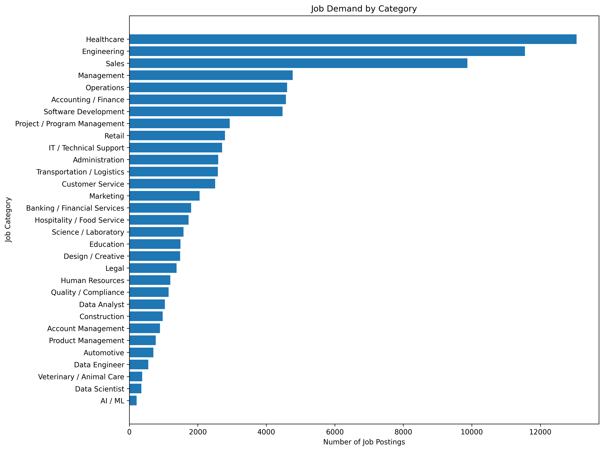
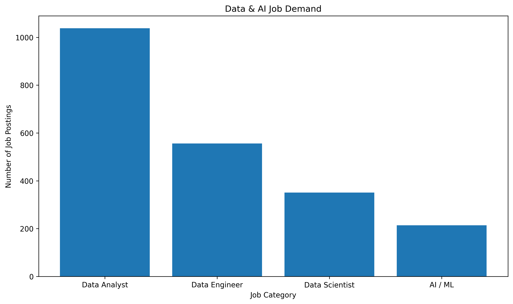
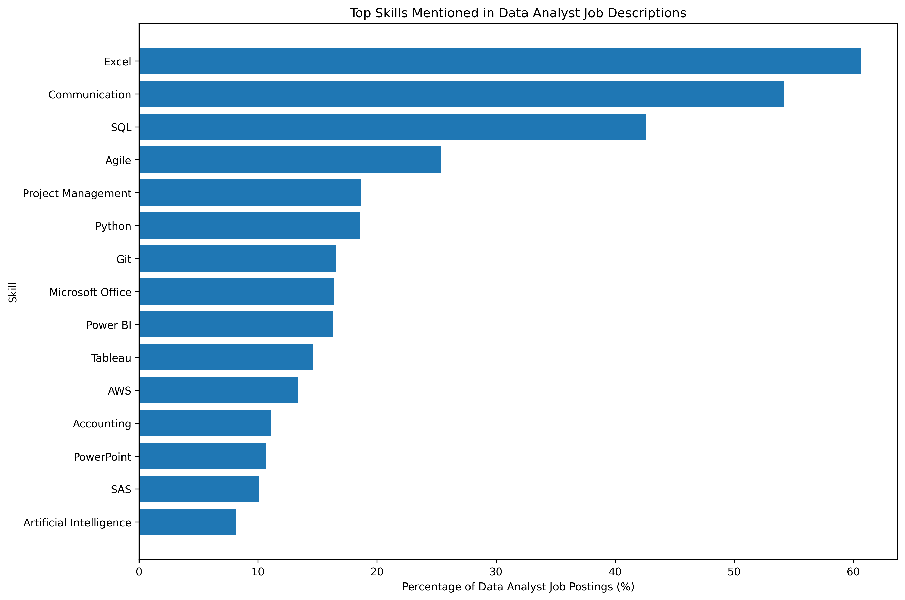
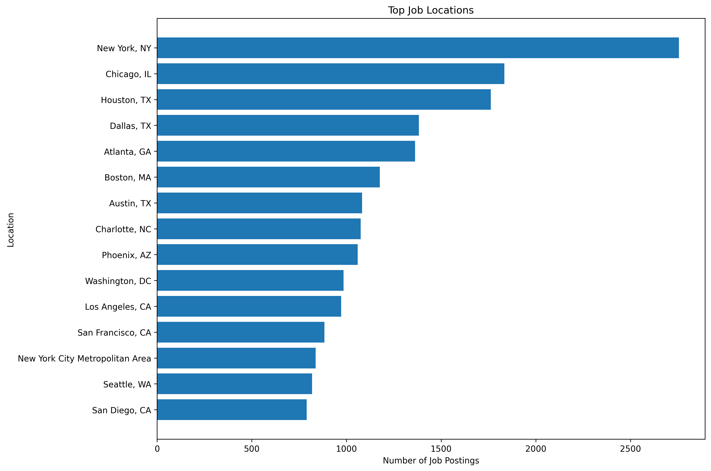
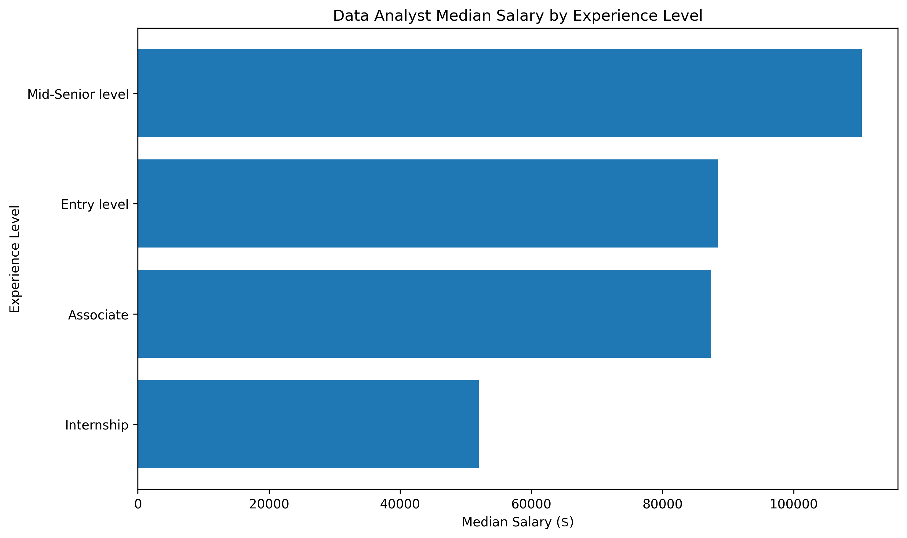
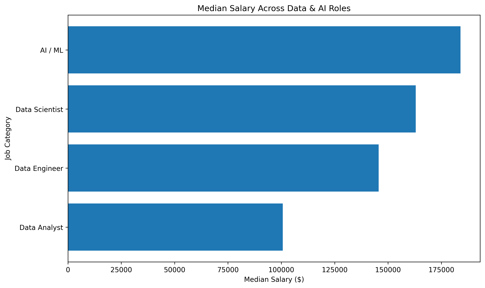
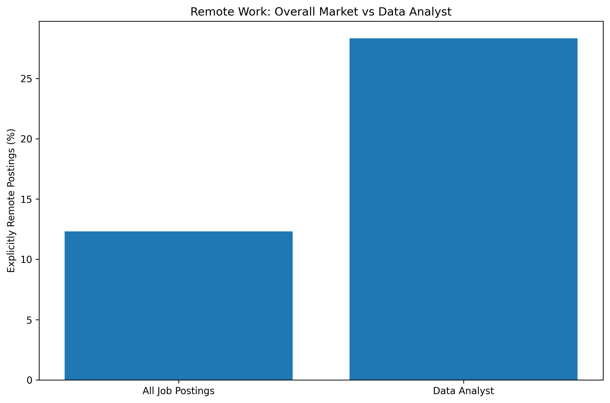

# LinkedIn Job Trend Analysis

Data Analyst roles get a lot of advice attached to them — learn Python, learn ML, build a portfolio. Most of that advice is based on vibes, not data. This project pulls apart 123,849 real LinkedIn job postings to see what employers are actually asking for, where the jobs are, and what they pay — with a focused deep-dive on Data Analyst postings specifically.

## The Question

If you're trying to break into a Data Analyst role, what should you actually be prioritizing? This analysis answers that with postings data instead of guesswork:

- How big is the Data Analyst job market relative to adjacent roles (Data Engineer, Data Scientist, AI/ML)?
- Which skills actually show up in Data Analyst postings, and how often?
- What's the real gap between SQL, Excel, Python, Power BI, and Tableau demand?
- Where are these jobs concentrated, and how often are they remote?
- What do they pay, by experience level?

## Dataset

[LinkedIn Job Postings dataset (Kaggle)](https://www.kaggle.com/datasets/arshkon/linkedin-job-postings) — 123,849 postings with title, company, description, location, salary, experience level, and work type.

Raw data isn't included in this repo because the dataset is too large for GitHub. Download it from Kaggle to reproduce the analysis.

## What I Did

1. **Cleaned the data** — dropped columns with near-total missing values, parsed timestamp fields, standardized text columns, and removed duplicate job IDs.
2. **Engineered features** — created salary bands, remote/hybrid/on-site classification, application and engagement rates, description length, title length, company posting counts, location posting counts, and a rule-based job classifier covering 32 job categories.
3. **Ran EDA** across job category demand, skills, locations, experience levels, work arrangements, and salary.
4. **Isolated Data Analyst postings** for a focused deep-dive covering skills, salary by experience, remote share, top hiring locations, and top hiring companies.
5. **Extracted skills from job descriptions** using keyword-based matching across technical, business, cloud, programming, analytics, and communication skills.
6. **Caught and fixed a salary data quality problem** — the raw salary field contained entries as high as $535.6M for a single posting, which were clearly unrealistic for this analysis. I inspected salary percentiles and outlier counts, then restricted the salary analysis to records between $20K and $500K. This retained 35,502 of 36,073 salary records (98.42%).

## Key Findings

### The Data Analyst title is a small slice of the market

Of 123,849 postings, 1,038 (0.84%) were classified as Data Analyst roles.

Data Engineer, Data Scientist, and AI/ML roles added another 1,121 postings, meaning the four Data & AI categories together represented approximately 1.74% of all postings in the dataset.

Healthcare (10.5%), Engineering (9.3%), and Sales (8.0%) had substantially more postings than the Data Analyst category.

This is useful context when evaluating the size of the market rather than assuming the job market is centered around a specific target role.

### Excel beats SQL beats Python — by a wide margin

In Data Analyst postings specifically:

| Skill | % of Data Analyst postings |
|---|---:|
| Excel | 60.7% |
| SQL | 42.6% |
| Python | 18.6% |
| Power BI | 16.3% |
| Tableau | 14.6% |

Excel is the single most-requested skill for Data Analyst postings in this dataset, appearing in more than 60% of classified Data Analyst job descriptions.

SQL appears in 42.6% of postings, while Python appears in 18.6%.

This suggests that Excel and SQL should remain high-priority skills for candidates targeting Data Analyst roles.

### Power BI has a small edge over Tableau

Power BI appeared in 16.3% of Data Analyst postings, compared with 14.6% for Tableau.

The difference is relatively small, but it provides useful evidence when deciding which BI tool to prioritize first.

### Data Analyst roles are more frequently remote than the overall market

28.3% of Data Analyst postings in the dataset were explicitly classified as remote.

Across all job postings, only 12.3% were explicitly classified as remote.

This means Data Analyst postings were explicitly remote at roughly 2.3 times the overall market rate in this dataset.

### Mid-Senior Data Analyst roles have the highest median salary

Among Data Analyst postings with usable salary data:

| Experience Level | Postings | Median Salary |
|---|---:|---:|
| Mid-Senior | 164 | $110,375 |
| Entry Level | 31 | $88,400 |
| Associate | 50 | $87,430 |
| Internship | 3 | $52,000 |

Mid-Senior Data Analyst postings had the highest median salary at $110,375.

The Entry Level and Internship samples are relatively small, especially the Internship category, so those figures should be treated as directional rather than definitive.

Only 303 of the 1,038 Data Analyst postings had usable salary data after cleaning.

### Data Analyst salary compared with adjacent Data & AI roles

Among cleaned salary records:

| Job Category | Postings | Median Salary |
|---|---:|---:|
| AI / ML | 79 | $184,000 |
| Data Scientist | 112 | $163,050 |
| Data Engineer | 166 | $145,600 |
| Data Analyst | 303 | $100,713.60 |

The results show a substantial difference in median salary between Data Analyst roles and the adjacent Data & AI categories in this dataset.

However, these figures reflect only postings with available and usable salary information.

### Top companies hiring Data Analysts

The companies with the highest number of Data Analyst postings in this dataset included:

1. DataAnnotation — 37 postings
2. ATC — 21 postings
3. Fidelity Investments — 11 postings
4. Dice — 11 postings
5. TELUS International — 11 postings
6. TELUS International AI Data Solutions — 10 postings
7. Insight Global — 9 postings
8. Talentify.io — 8 postings
9. Tata Consultancy Services — 8 postings
10. Coders Data — 8 postings

The list includes both large enterprises and staffing/recruiting platforms, highlighting the variety of channels through which Data Analyst opportunities are posted.

## Visualizations

### Job Demand by Category

### Data & AI Job Demand

### Data Analyst Skills

### Top Job Locations

### Data Analyst Salary by Experience

### Data & AI Salary Comparison

### Remote Work Comparison

## Limitations

- **Skill extraction is keyword-based** against job descriptions, not a trained NLP model. It can miss synonyms, abbreviations, or context-dependent meanings.
- **Salary data is sparse.** Salary information was available for approximately 29% of all postings, and only 303 of the 1,038 Data Analyst postings had usable salary data after cleaning.
- **Salary information is self-reported by job posters**, so the available salary sample may not represent the entire market.
- **Job category classification is rule-based** using title keywords. It performs well for common job titles but can misclassify unusual or vague titles. Approximately 28.3% of postings remained in the `Other` category.
- **The dataset is a snapshot**, not a time series. The analysis represents the job market captured in this dataset rather than long-term hiring trends.
- **Location and work arrangement fields contain missing or unspecified values**, so remote-work percentages represent postings explicitly identified as remote rather than all jobs that may allow remote work.

## Tools

- Python
- Pandas
- Matplotlib
- NumPy
- Regular expressions / keyword matching
- GitHub

